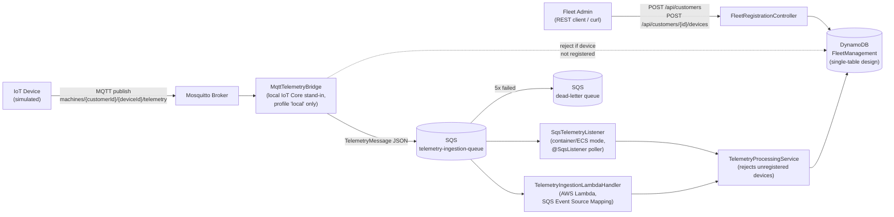

# Serverless IoT Telemetry Ingestion Engine

A Proof of Concept demonstrating a **real, deployable serverless ingestion pipeline** for
high-throughput, bursty time-series telemetry from heavy machinery fleets (excavators, trucks,
generators). Built with **Java 21**, **Spring Boot 3.5**, **AWS SDK v2**, and a genuine
**AWS Lambda** entry point — not just a container labeled "serverless".

## 🏗️ Architecture Overview



*In production, real IoT devices would publish directly to AWS IoT Core, whose Rules Engine
forwards to SQS — the Mosquitto broker + `MqttTelemetryBridge` only exist to reproduce that
behavior locally, for free, in the `local` profile. The `SqsTelemetryListener` and the Lambda
handler are two alternative consumers of the same queue — you deploy one or the other, not both.
The `FleetRegistrationController` is the only legitimate way to onboard a Customer/Device — telemetry
for any (customerId, deviceId) pair that never went through it is rejected, both at the MQTT edge
and inside `TelemetryProcessingService` (shared by both consumer modes).*

The same Spring beans (`TelemetryProcessingService`, `FleetRepository`, the polymorphic DynamoDB
schema) are reused by **two interchangeable deployment modes** — you pick one per environment,
not both at once:

| Mode | Entry point | When to use |
| :--- | :--- | :--- |
| **Consumer (container/ECS/EC2)** | `SqsTelemetryListener` (`@SqsListener`, long-running poller) | Traditional container deployment; simplest local dev loop. |
| **Serverless (AWS Lambda)** | `TelemetryIngestionLambdaHandler` (`RequestHandler<SQSEvent, SQSBatchResponse>`) | Real "pay-per-invocation" deployment — no idle process, AWS's own SQS Event Source Mapping does the polling. Deployed via `template.yaml` (AWS SAM). |

### Key Technical Decisions
* **Java 21 & Spring Boot 3.5:** Virtual Threads (Project Loom) for lightweight, non-blocking
  concurrent SQS message processing. (Spring Boot 4.x was evaluated and intentionally rejected for
  now — see [Why Spring Boot 3.5, not 4](#why-spring-boot-35-not-4).)
* **Amazon DynamoDB Single-Table Design:** `Customer`, `Device`, and `Telemetry` entities live in
  one physical table, replacing relational `JOIN`s with predictable, single-digit-millisecond
  `Query`s.
* **Hand-rolled polymorphic `TableSchema<BaseEntity>`:** AWS SDK v2's Enhanced Client has no
  built-in support for mapping a discriminator column to multiple bean types in one table, so
  `PolymorphicFleetTableSchema` dispatches by an `EntityType` attribute to per-subtype
  `BeanTableSchema`s.
* **Two real deployment modes, one business-logic layer:** the Lambda handler is not a toy —
  it reuses the exact same Spring context and `TelemetryProcessingService` as the container mode,
  reports **partial batch item failures** back to SQS (so only genuinely failed messages are
  retried), and ships with a **SAM template** (`template.yaml`) wiring the queue, DLQ, table, IAM
  policies, and the SQS→Lambda event source mapping.
* **Hermetic integration testing:** `TelemetryStreamIntegrationTest` uses **Testcontainers +
  LocalStack** to exercise the real SQS → DynamoDB flow with no AWS costs or credentials, in CI or
  locally with Docker.
* **Device onboarding & telemetry rejection:** a small REST API (`FleetRegistrationController`)
  is the only way to register a Customer/Device; telemetry for any pair that wasn't registered
  is rejected both at the MQTT edge and, more importantly, inside `TelemetryProcessingService`
  itself — enforced identically whether the message arrived via the container consumer or the
  Lambda handler, since a real AWS IoT Core deployment would post straight to SQS and bypass the
  Mosquitto bridge entirely.

---

## 📊 DynamoDB Data Model (Single-Table Design)

The fleet domain is mapped into a single DynamoDB table (name configurable via
`app.dynamodb.table-name`, defaults to `FleetManagement`) using generic primary keys (`PK`/`SK`).

| Entity Type | PK (Partition Key) | SK (Sort Key) | Attributes |
| :--- | :--- | :--- | :--- |
| **Customer** | `CUSTOMER#<CustomerId>` | `METADATA` | `customerName`, `customerEmail` |
| **Device** | `CUSTOMER#<CustomerId>` | `DEVICE#<DeviceId>` | `deviceModel`, `deviceStatus` |
| **Telemetry** | `DEVICE#<DeviceId>` | `TELEMETRY#<Timestamp>` | `fuelLevel`, `latitude`, `longitude` |

### Supported Access Patterns
1. **AP1:** Fetch a Customer and all their registered equipment in a single network roundtrip
   (`Query` where `PK = CUSTOMER#<Id>`).
2. **AP2:** Fetch a device's telemetry history within a time range, sorted at the storage level
   (`Query` where `PK = DEVICE#<Id>` and `SK BETWEEN TELEMETRY#<Start> AND TELEMETRY#<End>`).

---

## 🛠️ Tech Stack

* **Language:** Java 21
* **Framework:** Spring Boot 3.5 (Spring Cloud AWS 3.4, Spring MVC + Bean Validation for the
  registration REST API)
* **AWS Services:** Amazon DynamoDB, Amazon SQS (+ DLQ), AWS Lambda
* **SDK:** AWS SDK for Java v2 (`DynamoDbEnhancedClient`)
* **IaC:** AWS SAM (`template.yaml`)
* **Local IoT Core substitute:** Eclipse Mosquitto (MQTT) + Eclipse Paho client
* **DynamoDB inspection:** `dynamodb-admin` web UI (bundled in `docker-compose.yaml`)
* **Testing:** JUnit 5, Testcontainers, LocalStack
* **CI/CD:** GitHub Actions

---

## 🚀 How to Run & Test Locally

### Prerequisites
* Docker / Docker Desktop (or any Docker Engine, e.g. via WSL2 on Windows)
* Java 21 JDK
* Maven 3.9+
* (Optional, for the Lambda path) [AWS SAM CLI](https://docs.aws.amazon.com/serverless-application-model/latest/developerguide/install-sam-cli.html)

### 1. Run the full test suite (LocalStack + Testcontainers)
Spins up ephemeral DynamoDB/SQS containers automatically — no AWS account or credentials needed.

```bash
mvn clean verify
```

### 1b. Browse DynamoDB in your browser (no AWS CLI needed)
`docker-compose.yaml` includes [`dynamodb-admin`](https://github.com/aaronshaf/dynamodb-admin), a
lightweight web UI pointed at LocalStack's DynamoDB. Once the stack is up (`docker compose up -d`),
open **http://localhost:8001** to browse the `FleetManagement` table, inspect items (Customer,
Device, Telemetry rows — distinguishable by their `PK`/`SK`/`EntityType` attributes), and run ad-hoc
scans/queries — a much faster alternative to `aws dynamodb query` + JSON quoting headaches for
casual inspection during a demo.

### 2. Run the "consumer" mode end-to-end locally (step-by-step manual test)

This walks through a full, manual, end-to-end test of the MQTT → SQS → DynamoDB pipeline using
`docker-compose`, with concrete commands for what to send and what to check.

> **Windows note:** the `aws` CLI commands below assume it's installed on your host (e.g. via
> `winget install Amazon.AWSCLI`) with dummy credentials exported for the session
> (`$env:AWS_ACCESS_KEY_ID="test"; $env:AWS_SECRET_ACCESS_KEY="test"; $env:AWS_DEFAULT_REGION="us-east-1"`).
> If you'd rather not install anything, every `aws --endpoint-url=http://localhost:4566 <args>`
> command below can be replaced with `docker compose exec localstack awslocal <args>` instead —
> `awslocal` is a CLI wrapper baked into the LocalStack image with the endpoint/credentials
> pre-configured. The only exception is `--cli-input-json file://samples/...`, which needs the
> file to exist *inside* the container first: `docker cp samples/seed-customer.json localstack_iot_engine:/tmp/` ,
> then reference `/tmp/seed-customer.json` instead.

**a) Start the infrastructure**
```bash
docker-compose up -d          # LocalStack (DynamoDB, SQS) + Mosquitto
```
Wait until LocalStack's init script finishes (creates the `FleetManagement` table and the
`telemetry-ingestion-queue`):
```bash
docker compose logs -f localstack   # look for "INITIALIZATION COMPLETED"
```
Sanity-check the resources exist:
```bash
export AWS_ACCESS_KEY_ID=test AWS_SECRET_ACCESS_KEY=test AWS_DEFAULT_REGION=us-east-1
aws --endpoint-url=http://localhost:4566 dynamodb list-tables
aws --endpoint-url=http://localhost:4566 sqs list-queues
```

**b) Register a Customer + Device via the new REST API**
This PoC now ships a small onboarding API (`FleetRegistrationController`) instead of requiring raw
`aws dynamodb put-item` calls. It's also the *only* legitimate way to let a device send telemetry —
messages from a (customerId, deviceId) pair that was never registered here are rejected before
they're written to DynamoDB (see [Device registration & telemetry rejection](#device-registration--telemetry-rejection) below).
```bash
curl -X POST http://localhost:8080/api/customers \
  -H "Content-Type: application/json" \
  -d '{"id":"101","name":"Heavy Equipment Sp. z o.o.","email":"fleet@example.com","premiumSupportActive":true}'

curl -X POST http://localhost:8080/api/customers/101/devices \
  -H "Content-Type: application/json" \
  -d '{"id":"VIN-HEAVY-TRUCK-99","model":"CAT-797F"}'
```
Both return `201 Created` with the created resource; a repeated call returns `409 Conflict`, and
registering a device for a customer that doesn't exist returns `404 Not Found`. You can fetch them
back with `GET /api/customers/101` and `GET /api/customers/101/devices/VIN-HEAVY-TRUCK-99`.

> **Windows/PowerShell note:** `curl` above is `curl.exe` (bundled with Windows 10/11), which
> handles this quoting fine as-is. If you're using PowerShell's `curl` alias for `Invoke-WebRequest`
> instead, either call `curl.exe` explicitly or use `Invoke-RestMethod` with a here-string body.

<details>
<summary>Alternative: seed directly via DynamoDB (no app instance required)</summary>

If you'd rather not start the Spring Boot app first, the original fixtures are still valid (the
REST API and direct `put-item` write the exact same item shape):
```bash
aws --endpoint-url=http://localhost:4566 dynamodb put-item --cli-input-json file://samples/seed-customer.json
aws --endpoint-url=http://localhost:4566 dynamodb put-item --cli-input-json file://samples/seed-device.json
```
</details>


**c) Start the application** (in a separate terminal):
```bash
mvn spring-boot:run -Dspring-boot.run.profiles=local
```
In the logs, confirm the MQTT bridge came up:
```
c.g.d.s.t.e.i.mqtt.MqttTelemetryBridge : MQTT bridge connected to tcp://localhost:1883 and subscribed to 'machines/+/+/telemetry'
```

**d) Publish a telemetry reading over MQTT**, using the sample payloads shipped in `samples/`
(`telemetry-normal.json` and `telemetry-critical.json`, matching the `Telemetry` JSON shape).
The topic encodes `customerId`/`deviceId`: `machines/101/VIN-HEAVY-TRUCK-99/telemetry`.
```bash
docker cp samples/telemetry-normal.json mosquitto_mqtt_broker:/tmp/telemetry-normal.json
docker compose exec mosquitto mosquitto_pub -h localhost \
  -t "machines/101/VIN-HEAVY-TRUCK-99/telemetry" -f /tmp/telemetry-normal.json
```
(You can also skip the file entirely and pass `-m '{"timestamp":"2025-01-01T12:00:00Z", ...}'`
inline instead of `-f`.)

**e) What to check in the application logs** — you should see, in order:
```
MqttTelemetryBridge  : Forwarded MQTT reading from device VIN-HEAVY-TRUCK-99 (customer 101) to SQS
SqsTelemetryListener : Received telemetry reading for device VIN-HEAVY-TRUCK-99 (customer 101)
```
If instead you see a `MessageConversionException` about `java.time.Instant`, it means the shared
`ObjectMapper` bean (`JacksonConfig`) isn't being picked up by the SQS message converter — this
was a real bug caught while hardening this PoC. (Historical note: it originally surfaced because
the project had no `spring-boot-starter-web`, so Jackson wasn't auto-configured at all. Now that
`spring-boot-starter-web` is a dependency — added for the registration REST API — Spring Boot
*would* auto-configure a default `ObjectMapper` too, but `JacksonConfig`'s explicit `@Bean` still
wins over the auto-configured one, guaranteeing `JavaTimeModule` is always registered regardless
of which starters happen to be on the classpath.)

### Device registration & telemetry rejection
This PoC treats "any device that knows the topic/queue" as untrusted by default. Try publishing
telemetry for a device you *never* registered in step (b):
```bash
docker compose exec mosquitto mosquitto_pub -h localhost \
  -t "machines/101/UNKNOWN-DEVICE-1/telemetry" -m '{"timestamp":"2025-01-01T12:00:00Z","fuelLevel":50,"latitude":50.0,"longitude":20.0,"hydraulicPressurePsi":2000}'
```
You should see the bridge reject it immediately, before it ever reaches SQS:
```
MqttTelemetryBridge : Rejecting telemetry from unregistered device UNKNOWN-DEVICE-1 (customer 101) - register it first via POST /api/customers/101/devices
```
This is enforced twice: once at the MQTT edge (`MqttTelemetryBridge`, fail-fast for local/dev), and
again in `TelemetryProcessingService.processIncomingBatchFromMachine` (the real production
enforcement, shared by both the `SqsTelemetryListener` consumer mode *and* the Lambda handler,
since AWS IoT Core would post directly to SQS in a real deployment, bypassing the Mosquitto bridge
entirely). If a message somehow reaches the queue for an unregistered device anyway (e.g. a bug or
a bypassed bridge), `UnregisteredDeviceException` propagates, the SQS message is *not*
acknowledged, and after `maxReceiveCount` (5, see `template.yaml`) retries it lands in the
dead-letter queue for manual review — it is never silently written to DynamoDB.

**f) What to check in DynamoDB** — the telemetry reading should now be persisted:
```bash
aws --endpoint-url=http://localhost:4566 dynamodb query --table-name FleetManagement \
  --key-condition-expression "PK = :pk AND begins_with(SK, :prefix)" \
  --expression-attribute-values '{":pk":{"S":"DEVICE#VIN-HEAVY-TRUCK-99"},":prefix":{"S":"TELEMETRY#"}}'
```
> **Windows / PowerShell note:** the native `aws.exe` (CLI v2) does not honor `'...'` the same way
> bash does — single quotes don't protect the inner `"..."`, so nested JSON gets mangled
> (you'll see an error like `JSON received: {:pk:{S:...}}` with all the quotes stripped).
> Use a JSON file instead, which works identically on every shell:
> ```powershell
> aws --endpoint-url=http://localhost:4566 dynamodb query --table-name FleetManagement `
>   --key-condition-expression "PK = :pk AND begins_with(SK, :prefix)" `
>   --expression-attribute-values file://samples/query-telemetry-eav.json
> ```
> (a ready-made `samples/query-telemetry-eav.json` is included). If you'd rather keep it inline in
> PowerShell, wrap the JSON in double quotes and double every inner `"`, e.g.
> `--expression-attribute-values "{"":pk"":{""S"":""DEVICE#VIN-HEAVY-TRUCK-99""},"":prefix"":{""S"":""TELEMETRY#""}}"`
> — but `file://` is far less error-prone. This applies whether you call `aws` directly or via
> `docker compose exec localstack awslocal ...`.

Now publish `samples/telemetry-critical.json` (hydraulic pressure > 3000 PSI) the same way, and
confirm the business rule fired — the device's status should flip to `CRITICAL_ERROR`:
```bash
aws --endpoint-url=http://localhost:4566 dynamodb get-item --table-name FleetManagement \
  --key '{"PK":{"S":"CUSTOMER#101"},"SK":{"S":"DEVICE#VIN-HEAVY-TRUCK-99"}}'
```
Finally, confirm the queue drained back to zero (i.e. nothing is stuck / dead-lettered):
```bash
aws --endpoint-url=http://localhost:4566 sqs get-queue-attributes \
  --queue-url http://localhost:4566/000000000000/telemetry-ingestion-queue \
  --attribute-names ApproximateNumberOfMessages
```

### 2b. Generate a larger batch of telemetry (load/demo helper)
To showcase the pipeline handling volume (SQS batching, `max-messages-per-poll`, DynamoDB writes)
rather than a single message, use the included helper script instead of publishing one file at a
time. It publishes N randomized telemetry readings directly via `mosquitto_pub -m` (no file copies
needed) and can sprinkle in a configurable ratio of "critical" readings that trip the
`CRITICAL_ERROR` business rule:
> **Important:** these scripts call `docker` directly, so run them from wherever `docker`
> is actually on your `PATH` — if you're on Docker Engine via WSL2 (no Docker Desktop),
> that's your **WSL/Ubuntu terminal**, not native Windows PowerShell.

```bash
# WSL / Linux shell (Docker Engine on WSL2, no Docker Desktop integration):
bash scripts/generate-telemetry-batch.sh 50 101 VIN-HEAVY-TRUCK-99 0.15 0.1
#    ^count ^customerId ^deviceId ^criticalRatio ^delaySeconds
```
```powershell
# Windows PowerShell (only if Docker Desktop's CLI integration puts `docker` on PATH):
.\scripts\generate-telemetry-batch.ps1 -Count 50 -CriticalRatio 0.15 -DelayMs 100
```
Parameters (both scripts): message count, `CustomerId`/`DeviceId` (must match a seeded
Customer/Device), the fraction of readings above the 3000 PSI threshold ("critical"), and the
delay between publishes (lower it to stress-test, raise it to watch logs scroll slowly).
Afterwards, re-run the DynamoDB `query` from step (f) above — `Count` should match the number of
readings published, and `get-queue-attributes` should show the queue back at 0.

### 3. Build & (optionally) deploy the Lambda path
```bash
mvn clean package                       # produces target/*-aws.jar (flat uber-jar for Lambda)
sam deploy --guided --template-file template.yaml
```
`template.yaml` provisions the SQS queue (with a dead-letter queue after 5 failed attempts), the
DynamoDB table, and the Lambda function wired to the queue via an Event Source Mapping with
`ReportBatchItemFailures` enabled.

---

## Why Spring Boot 3.5, not 4?

Spring Boot 4.0 was evaluated first. It was rejected for this PoC after hitting a concrete,
reproducible incompatibility: `spring-cloud-aws` (the library providing `@SqsListener` and the
DynamoDB Enhanced Client auto-configuration) only became compatible with Boot 4's API changes in
its own `4.x` line, and even then, Boot-property-level toggles that exist in the `3.x` line (e.g.
listener `auto-startup`) are exposed differently. Spring Boot 3.5.x is the last, most mature
release of the 3.x line, has full first-class support across `spring-cloud-aws 3.4.x`, and is the
version most production AWS Spring workloads currently run — making it the more honest and
portfolio-relevant choice than chasing a newly-released major version with a thinner ecosystem.

---

## Known Limitations (PoC scope)

* Device registration is deliberately minimal (no auth on the registration API itself) — anyone who
  can reach `POST /api/customers` can register a customer/device. What *is* enforced is that
  telemetry can only be ingested for pairs that went through this registration step first (see
  [Device registration & telemetry rejection](#device-registration--telemetry-rejection)); a real
  deployment would add authentication (e.g. OAuth2/API keys) in front of the registration API itself,
  plus AWS IoT Core device certificates/policies on the ingestion path.
* No observability stack (metrics/tracing) wired up yet — CloudWatch Lambda metrics and SQS queue
  depth alarms would be the natural next addition on top of the existing DLQ.
* `MqttTelemetryBridge` is a development/demo convenience, not a production IoT Core replacement;
  it is disabled by default (`mqtt.enabled=false`) and only turned on in the `local` profile.

---

## 📄 License
Distributed under the Apache License 2.0. See `LICENSE` for more information.

